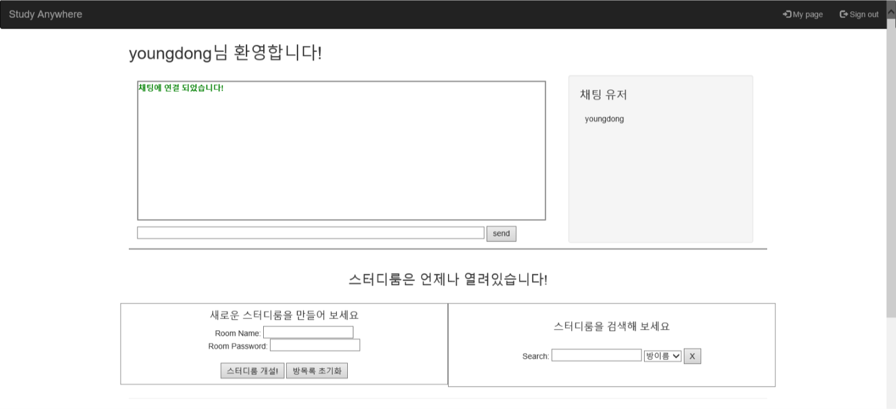
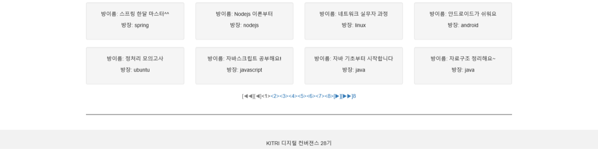
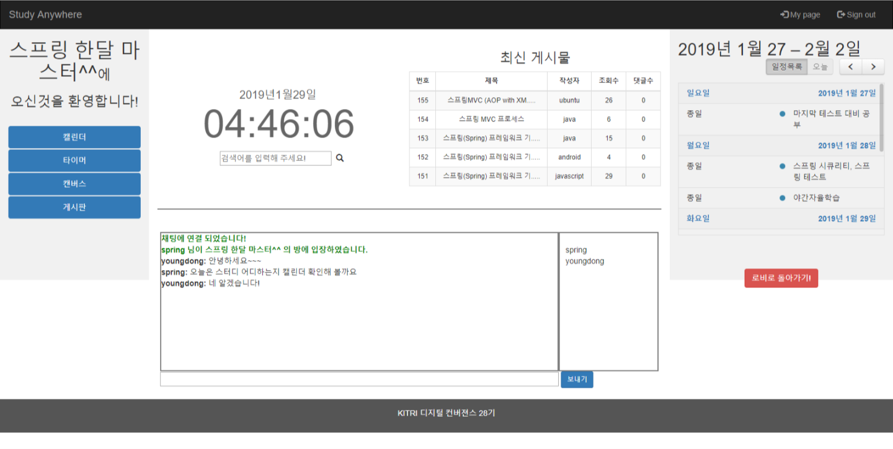
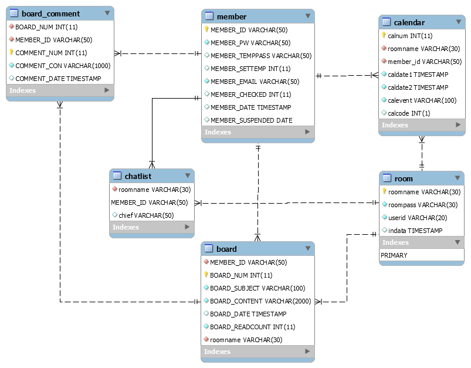
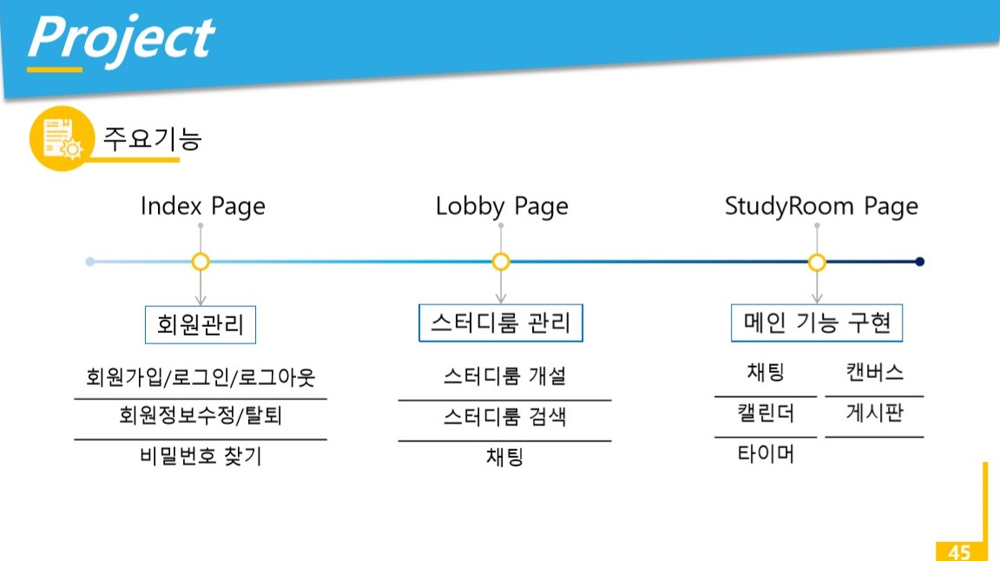

<h1>Study Anywhere</h1>

<h3>스터디 중계 애플리케이션</h3>

2019.01.02 - 2019.01.25(개발기간:3주)

진행인원 : 3명

[52.79.145.202/Study_Anywhere](http://52.79.145.202/Study_Anywhere)

| Version| Java 1.8.0_191, Node.js 10.15.0 | 
|:------:|:------:|
|   DBMS    |   MySQL 5.7.25    |
|   WAS    |   Apache Tomcat 8.0.32    |
|   사용기술    |   Servlet/Jsp/Jquery/Ajax/JavaScript/CSS/HTM L/JSON/JSTL/Node.js    |
|   Framework    |   Express, BootStrap    |
|   Design Pattern    |   MVC model 2    |
|   API    |   JDBC/fullcalendar/JavaMail    |
|   형상관리    |   Git    |
|   의존성 관리    |   Maven, npm    |

